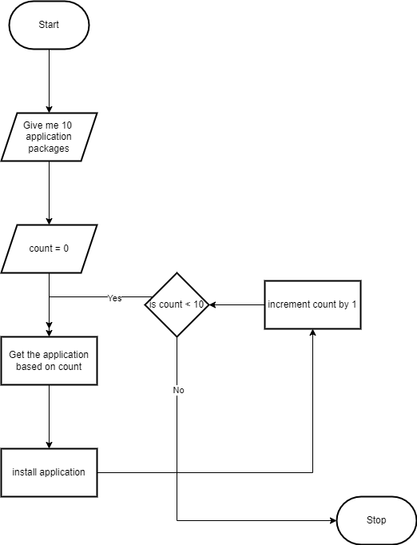
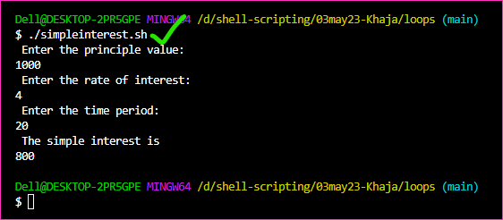
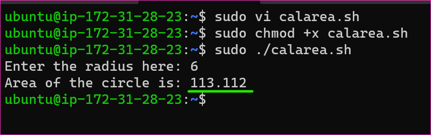

Looping Statements
--------------------

* We want to install 10 applications using apt. The flow chart will look some thing as shown below


* To perform looping in shell
    * while
    * for
    * until

* To alter loops we have two interesting commands
    * break
    * continue

* for loop to print sequence of values from 1 to 10
```bash
#!/bin/bash

# This program will print numbers from 1 to 10
for index in {1..10}
do
    echo $index
done
```

* Same loop in while
```bash
#!/bin/bash
index=1

while [[ $index -le 10 ]]
do
    echo $index
    # increment the value
    index=`expr $index + 1`
    #index=$((index + 1))
done
```

* loops wiht strings
```bash
#!/bin/bash
SOFTWARES="git tree nano vim"

for SOFTWARE in $SOFTWARES
do
    echo "SOFTWARE to be insttalled is $SOFTWARE"
done
```

* To read the input from the user
```bash
#!/bin/bash

TO_BE_INSTALLED=y
while [ "$TO_BE_INSTALLED" == "y" ]
do
    # ask the software to be installed
    read -p "Enter the sofware which you want to install: " NAME
    echo "Software to be installed is $NAME"
    read -p "If you want to install more softwares enter y and any other key to exit: " TO_BE_INSTALLED
done
```


* Change the above program, when user enter y or Y or Yes or yes continue any other key exit.
```bash
#!/bin/bash

TO_BE_INSTALLED=y
while [[ "$TO_BE_INSTALLED" == "y" || "$TO_BE_INSTALLED" == "Y" || "$TO_BE_INSTALLED" == "Yes" || "$TO_BE_INSTALLED" == "yes" ]]
do
    # ask the software to be installed
    read -p "Enter the sofware which you want to install: " NAME
    echo "Software to be installed is $NAME"
    read -p "If you want to install more softwares enter y and any other key to exit: " TO_BE_INSTALLED
done
```

* to write multiple or conditions

```
# Single POSIX test command with -o operator (not recommended anymore).
# Quotes strongly recommended to guard against empty or undefined variables.
while [ "$stats" -gt 300 -o "$stats" -eq 0 ]

# Two POSIX test commands joined in a list with ||.
# Quotes strongly recommended to guard against empty or undefined variables.
while [ "$stats" -gt 300 ] || [ "$stats" -eq 0 ]

# Two bash conditional expressions joined in a list with ||.
while [[ $stats -gt 300 ]] || [[ $stats -eq 0 ]]

# A single bash conditional expression with the || operator.
while [[ $stats -gt 300 || $stats -eq 0 ]]

# Two bash arithmetic expressions joined in a list with ||.
# $ optional, as a string can only be interpreted as a variable
while (( stats > 300 )) || (( stats == 0 ))

# And finally, a single bash arithmetic expression with the || operator.
# $ optional, as a string can only be interpreted as a variable
while (( stats > 300 || stats == 0 ))
```

### Arithmetic
* [Refer Here](https://ryanstutorials.net/bash-scripting-tutorial/bash-arithmetic.php) for bash arithmetic.


### Figuring out if the input is even or odd
* Solution
```bash
#!/bin/bash
read -p "Enter the number: " NUMBER
REMAINDER=$(($NUMBER % 2))
if [[ $REMAINDER -eq 0 ]]
then
    echo "$NUMBER is even"
else
    echo "$NUMBER is odd"
fi
```

### Exercises

* Take 3 inputs p,t,r and calculate simple intrest.
* Take 1 input r (radius of circle) and calculate area `A=πr2` [Refer Here](https://www.cuemath.com/geometry/area-of-a-circle/). 
* Take marks from 6 subjects of your choice and calculate average marks. based of that decide grades.

### Workout for Exercises

* Take 3 inputs p,t,r and calculate simple intrest.
* [Refer Here](https://github.com/qtaarkayapril23/shell-scripting/blob/main/03may23-Khaja/loops/simpleinterest.sh) for the script of simpleinterest.sh


* Take 1 input r (radius of circle) and calculate area `A=πr2`
* [Refer Here](https://github.com/qtaarkayapril23/shell-scripting/blob/main/03may23-Khaja/loops/calarea.sh) for the script of calarea.sh


