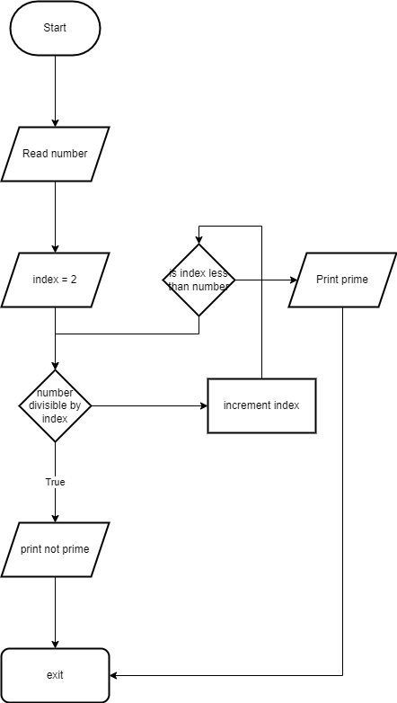
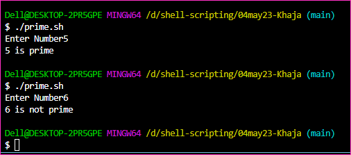
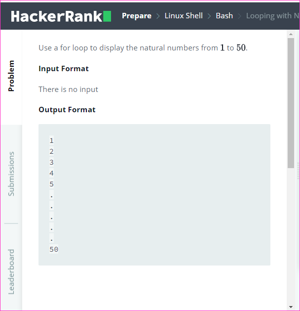

Floating point arithmetic
-------------------------
* [Refer Here](https://linuxhint.com/floating-point-math-bash/) for the floating point arithmetic.
* [Refer Here](https://www.geeksforgeeks.org/bc-command-linux-examples/) for the `bc` commands.


Solving problems in Hacker Rank
-------------------------------
* [Refer Here](https://www.hackerrank.com/access-account/) for the official website fo hacker rank.

* Flowchart to figure out if the number 


* Program
```bash
#!/bin/bash
read -p "Enter Number: " number
index=2
while [[ $index -lt number ]]
do
    REMAINDER=$((number%index))
    if [[ $REMAINDER -eq 0 ]]; then
        echo "$number is not prime"
        exit 1
    fi
    index=$((index+1))
done
echo "$number is prime"
```



Looping with Numbers
---------------------

* [Refer Here](https://www.hackerrank.com/challenges/bash-tutorials---looping-with-numbers/problem?isFullScreen=true) for the hacker rank problems.

### Use a for loop to display the natural numbers from  to .

* Input Format

* There is no input

* Output Format

1
2
3
4
5
.
.
.
.
.
50



```bash
#!/bin/bash
for i in {1..50}
do
    echo $i
done 
```


### Your task is to use for loops to display only odd natural numbers from  to .

* Input Format

* There is no input.

* Constraints

-

* Output Format

1
3
5
.
.
.
.
.
99  

```bash
#!/bin/bash
for ((i=1;i<=99;i=i+2))
do
    echo "$i"
done
```


### Sum of numbers
```
Sample input:
353 => 3+5+3 => 11 => 1+1 => 2
1414 => 1+4+1+4 => 10 => 1+0 => 1
414 => 4+1+4 => 9
```

