Shell-Scripting (SS)
--------------------

* Pre-requisite: Linux basic knowledge

OS used
--------

* I am mostly using AWS Linux 2. You can use any OS like Ubuntu, Centos, etc. Few commands will be changed based on OS.
    * For Ubuntu username is ubuntu.
    * For Centos username is centos.
    * For AWS Linux 2 username is ec2-user.

### The hello-world.sh

```bash
#!/bin/bash

echo "Hello World"
```
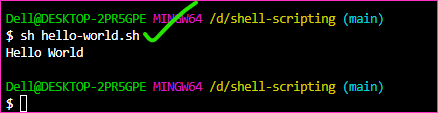

* Firstly we are using variables, let's get started

### The variables1.sh  

* [refer here](https://github.com/qtaarkayapril23/shell-scripting/blob/main/variables1.sh) for the first script variables1.sh

* The output getting
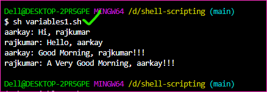


### The variables2.sh

* [refer here](https://github.com/qtaarkayapril23/shell-scripting/blob/main/variables2.sh) for the script variables2.sh

* The output getting
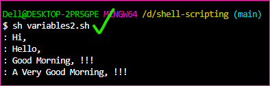


### The variables3.sh

* [refer here](https://github.com/qtaarkayapril23/shell-scripting/blob/main/variables3.sh) for the script variables3.sh

* The output getting
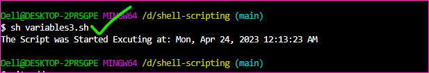


### The variables4.sh

* [refer here](https://github.com/qtaarkayapril23/shell-scripting/blob/main/variables4.sh) for the script variables4.sh

* The output getting
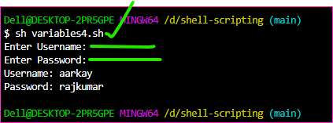


### The exit-status.sh

* [refer here](https://github.com/qtaarkayapril23/shell-scripting/blob/main/exit-status.sh) for the script exit-status.sh

* The getting output
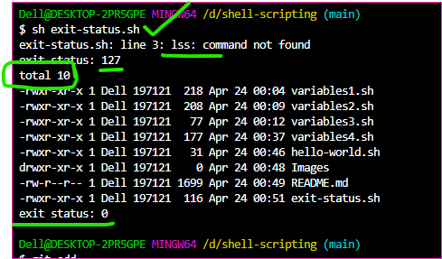


### The condition.sh

* [refer here](https://github.com/qtaarkayapril23/shell-scripting/blob/main/condition.sh) for the script condition.sh 

* The getting output
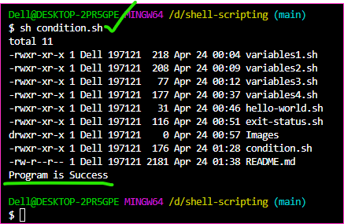


### The git-install.sh

* [refer here](https://github.com/qtaarkayapril23/shell-scripting/blob/main/git-install.sh/) for the script git-install.sh

* The getting output
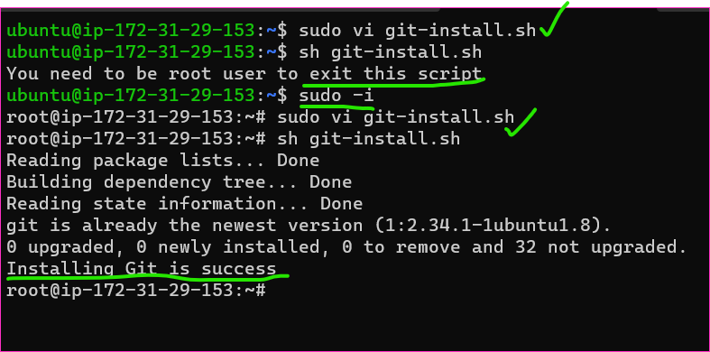


### The functions.sh

* [refer here](https://github.com/qtaarkayapril23/shell-scripting/blob/main/functions.sh) for the script functions.sh

* The getting output
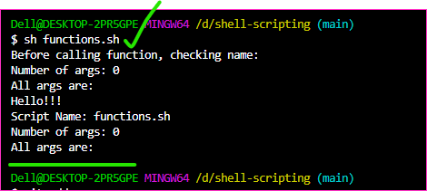


### The jenkins-install.sh

* [refer here](https://github.com/qtaarkayapril23/shell-scripting/blob/main/jenkins-install.sh) for the script jenkins-install.sh

* The getting output
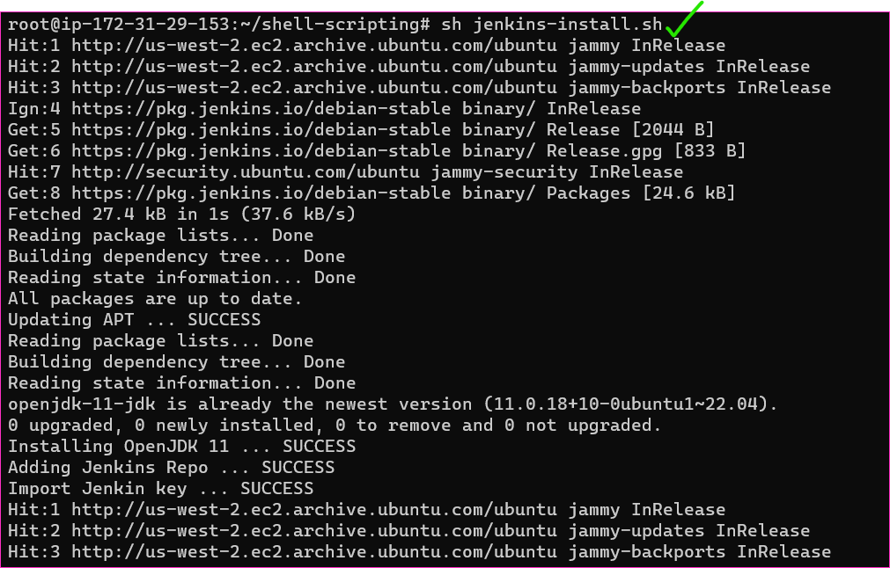
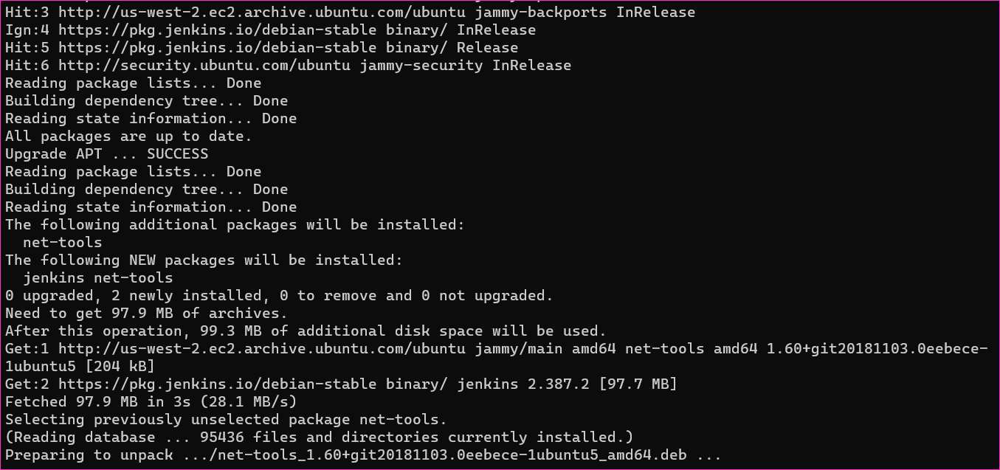
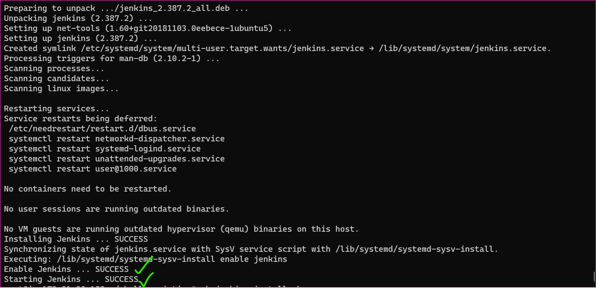

