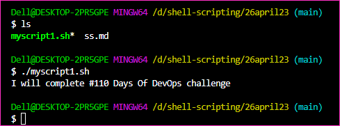
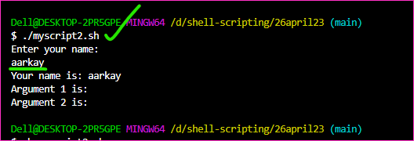

Shell Scripting for DevOps with Examples
----------------------------------------

### What is #!/bin/bash? can we write #!/bin/sh as well?

* The line “#!/bin/bash” is known as the shebang or hashbang. 
* It is a special character sequence that tells the system which interpreter to use for executing the script.

* In this case, “/bin/bash” specifies the Bash shell as the interpreter. 
* Bash is a popular shell on Linux and Unix systems and is commonly used for scripting.

* Yes, it is also possible to use “#!/bin/sh” in the shebang line. 
* “/bin/sh” specifies the Bourne shell as the interpreter. 
* The Bourne shell is an older shell that is less feature-rich than Bash, but it is still commonly available on many systems and can be used for simple scripting tasks.

* However, it is worth noting that Bash is backward compatible with Bourne shell syntax, so many scripts written for Bourne shell will work in Bash without modification. 
* Therefore, unless there is a specific reason to use the Bourne shell, it is generally recommended to use Bash for shell scripting.

### Explain in your own words and examples, what is Shell Scripting for DevOps?

* Shell scripting is a programming language that is used for automating tasks and system administration in a Linux or Unix environment. 
* In the context of DevOps, shell scripting plays a crucial role in automating repetitive tasks and streamlining the deployment and management of applications.

* With shell scripting, DevOps engineers can write scripts to automate tasks such as installing software packages, configuring systems, setting up network connections, and managing files and directories. 
* This reduces the manual effort required to perform these tasks, which in turn saves time and improves efficiency.

* For example, suppose a DevOps engineer wants to automate the process of deploying an application to a server. 
* With shell scripting, they can write a script that automates the entire process, including downloading the application code, setting up the necessary dependencies, configuring the server, and starting the application. 
* This script can then be executed automatically or with a simple command, reducing the time and effort required for deployment.

* Furthermore, shell scripting allows DevOps engineers to create custom scripts that can be integrated with other DevOps tools such as CI/CD pipelines, monitoring and alerting systems, and configuration management tools. 
* This integration enables the automation of end-to-end processes, from code development to deployment and monitoring.

* Overall, shell scripting is an essential skill for DevOps engineers as it enables the automation of complex and repetitive tasks, leading to increased efficiency and productivity in DevOps practices.

### Write a Shell Script which prints I will complete #110 Days of DevOps challenge.

* Here’s an example of a simple shell script that will print the message “I will complete #110 Days Of DevOps challenge” to the console:

* [refer here](https://github.com/qtaarkayapril23/shell-scripting/blob/main/26april23/myscript1.sh) for the myscript1.sh

* This script uses the “echo” command to output the message to the console. 
* The shebang line at the top of the script specifies that Bash should be used as the interpreter.

* To run this script, you can save it to a file with a “.sh” extension (e.g. “myscript.sh”), make it executable with the command “chmod +x myscript.sh”, and then execute it with “./myscript.sh” or by specifying the full path to the script.

### Write a Shell Script to take user input from arguments and print the variables?

* Here’s an example of a shell script that takes user input, input from arguments, and prints the variables:

* [refer here](https://github.com/qtaarkayapril23/shell-scripting/blob/main/26april23/myscript2.sh) for the myscript2.sh

* This script prompts the user to enter their name, reads the input into the variable “name”, and then assigns the first two command-line arguments to the variables “arg1” and “arg2”. 
* It then uses the “echo” command to print the values of these variables to the console, along with some descriptive text.

* To run this script, you can save it to a file with a “.sh” extension (e.g. “myscript.sh”), make it executable with the command “chmod +x myscript.sh”, and then execute it with “./myscript.sh arg1 arg2”, where “arg1” and “arg2” are the command-line arguments you want to pass to the script. 
* You will also be prompted to enter your name during execution.

### Write an Example of If else in Shell Scripting by comparing 2 numbers.

* Here’s an example of using if-else statements in shell scripting to compare two numbers:

* [refer here](https://github.com/qtaarkayapril23/shell-scripting/blob/main/26april23/myscript3.sh) for the myscript3.sh

* In this example, we assign the values 5 and 10 to the variables “num1” and “num2”, respectively. 
* We then use if-else statements to compare these two numbers.

* First, we check if num1 is greater than num2 using the condition [ $num1 -gt $num2 ]. 
* If this condition is true, we print the message “$num1 is greater than $num2”.

* If the first condition is false, we move on to the next condition using elif [ $num1 -lt $num2 ]. 
* If this condition is true, we print the message “$num1 is less than $num2”.

* If both of these conditions are false, we move on to the final else statement, which is executed when num1 is equal to num2. 
* In this case, we print the message “$num1 is equal to $num2”.

* To execute this script, you can save it to a file with a “.sh” extension (e.g. “my_script.sh”), make it executable with the command “chmod +x my_script.sh”, and then run it using “./my_script.sh”. 
* The output will be the message “$num1 is less than $num2”, since 5 is less than 10.

### The jenkins-install-modify.sh

* [Refer Here](https://github.com/qtaarkayapril23/shell-scripting/blob/main/26april23/jenkins-install-modify.sh) for the modified script called jenkins-install-modify.sh
![preview]

* *Thankyou for reading.*