Contents
--------

What is Scripting and How is it different from progrmming?
----------------------------------------------------------

* Every scripting language is a Programming Language, The one theoritical defference is programming languages are compile and then executed where as scripting languages don't have extra compilation step.


Live Example
------------

* We have written two scripts
* Shell Script
    * [Refer Here](https://github.com/qtaarkayapril23/shell-scripting/blob/main/27april23/diskspace.sh) for the script of shell.

```
vi diskspace.sh
sh diskspace.sh
```
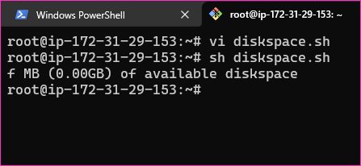

* Python script
    * [Refer Here](https://github.com/qtaarkayapril23/shell-scripting/blob/main/27april23/diskspace.py) for the script of python.

```
vi diskspace.py
python3 diskspace.py
```
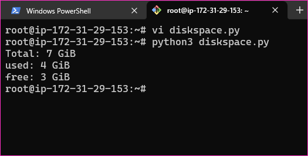


Approach - Part 1
-----------------

* Any script is a set of instructions executed line by line
* To become effective understanding flow of the program/script is essential

### Lets write a script to install docker
* Create a script (`installdocker.sh`) with following content 
* [Refer Here](https://github.com/qtaarkayapril23/shell-scripting/blob/main/27april23/installdocker.sh) for the script of installdocker.sh
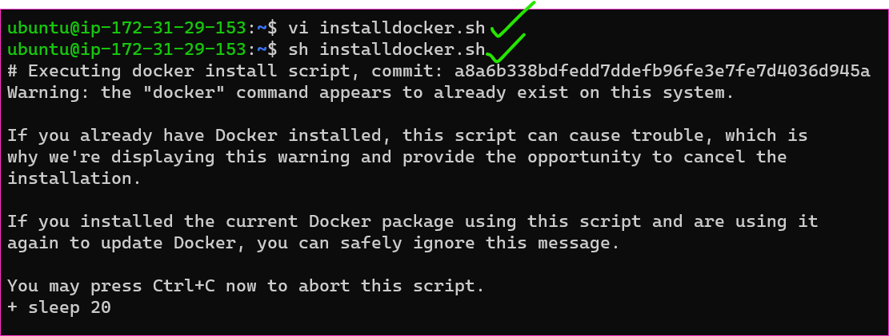
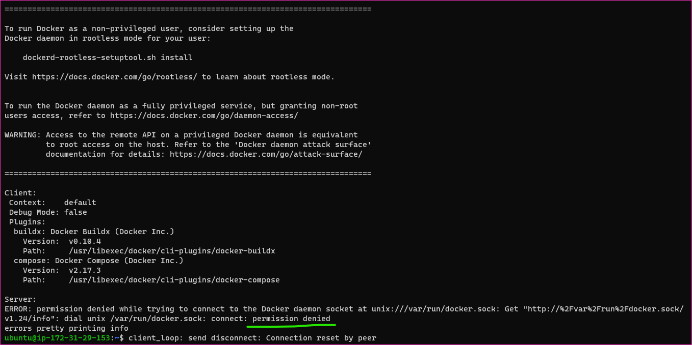
* It's showing error to resolve this 
* To become a root user and execute the below commands
```
vi installdocker.sh
sh installdocker.sh
```
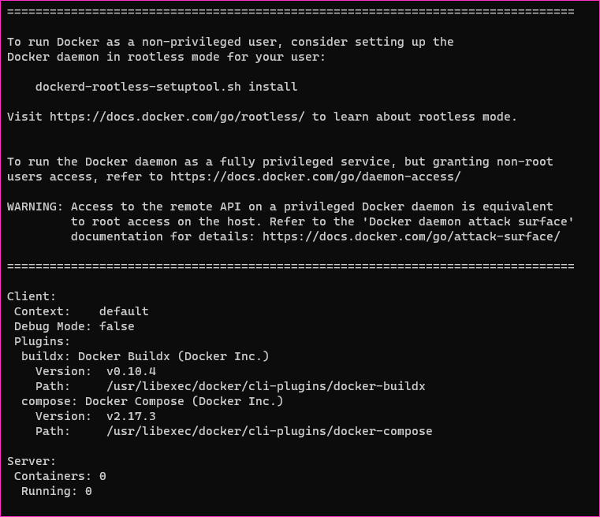
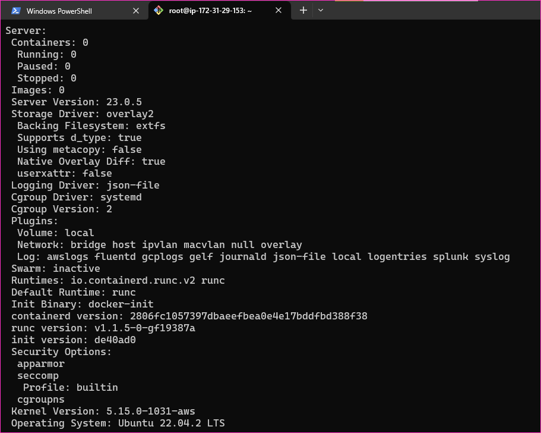
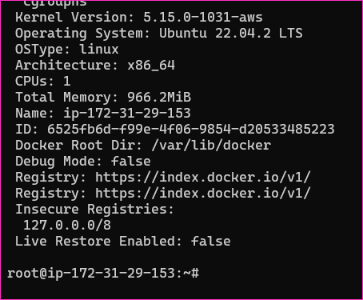
* Now give execute permissions and run the script `<path/>installdocker.sh`


### Exercise

* Write a shell script 
    * to install jenkins with java 11 
    * to install jenkins with java 17 
    * to install kubernetes (using kubeadm) `skip init`
* Note: all the scripts will be run as a root user

### Workout for Exercise
* [Refer Here](https://github.com/qtaarkayapril23/shell-scripting/blob/main/27april23/jenkins-java11.sh) for the script of install jenkins with java 11 as a root user.

```
vi jenkins-java11.sh
sh jenkins-java11.sh
```
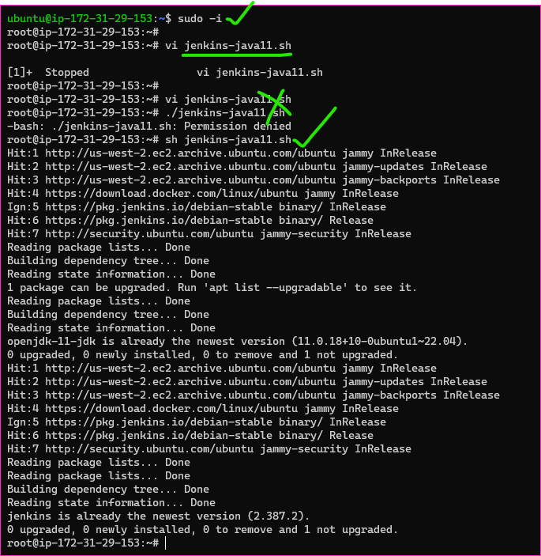
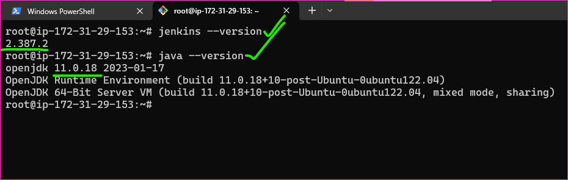

* [Refer Here](https://github.com/qtaarkayapril23/shell-scripting/blob/main/27april23/jenkins-java17.sh) for the script of isntall jenkins with java 17 as a root user.

```
vi jenkins-java17.sh
sh jenkins-java17.sh
```
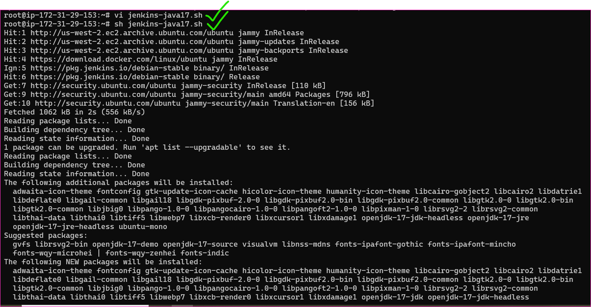
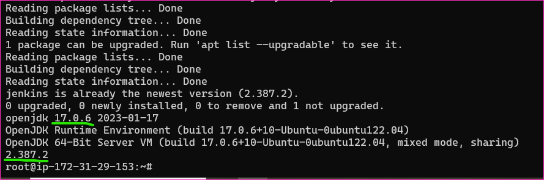

* [Refer Here](https://github.com/qtaarkayapril23/shell-scripting/blob/main/27april23/install-kubeadm.sh) for the script of installing kubeadm as a root user.

```
vi install-kubeadm.sh
sh install-kubeadm.sh
```
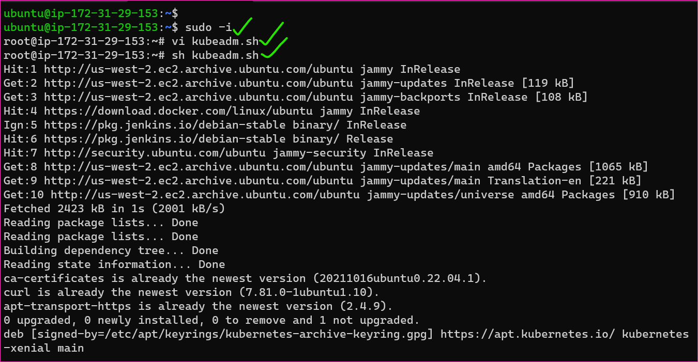
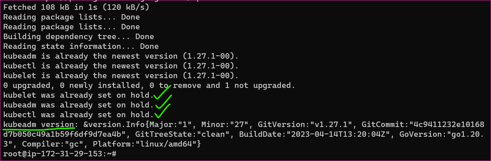