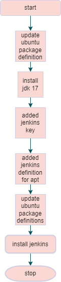

Scripting Types
---------------
* We create scripts for two major usecases
    * A person executing it
    * Automated execution (should not ask for user interaction)
* For DevOps/Cloud related activities we need automated execution

More on Scripting
-----------------

* According to last classes, we have to script to install jenkins
* [Refer Here](https://github.com/qtaarkayapril23/shell-scripting/blob/main/28april23/install-jenkins-java11.sh) for the script to install jenkins with java 11.
```
sudo vi installjenkins.sh
sudo chmod +x installjenkins.sh
sudo sh installjenkins.sh
```


* Lets try to look at this script in a different way by drawing a flow chart



* Lets try to draw a flow chart which will install jenkins on ubuntu and redhat systems


* Below is the script to install jenkins on redhat as well as ubuntu systems
* [Refer Here](https://github.com/qtaarkayapril23/shell-scripting/blob/main/28april23/install-jenkins.sh) for the script to install jenkins on both ubuntu and redhat.
```
sudo vi installjenkinsmulti.sh
sudo chmod +x installjenkinsmulti.sh
sudo ./installjenkinsmulti.sh
```
* For Redhat


* For ubuntu


### Expression
* An expression is combination of operands and operators which return some value

### Operators in bash
* [Refer Here](https://tldp.org/LDP/abs/html/ops.html) or operators in bash

### Conditional statements
* We have 4 conditional statements
    * if
    * if else
    * if elif else
    * switch
* Conditional statements require boolean operators

### References cheatsheet
* [Refer Here](https://devhints.io/bash) for the cheatsheet of bash

* Style Guide:
    * Shell:[Refer Here](https://google.github.io/styleguide/shellguide.html)
    * Python:[Refer Here](https://google.github.io/styleguide/pyguide.html)
### Installation
* Install draw.io from diagrams.net [Refer Here](https://www.diagrams.net/)
  
### Exercise
* Write a shell script to do the following
    * If the os is redhat 
        * install jenkins with jdk 11
        * install awscli
        * install azure cli
    * If the os is ubuntu
        * install awscli
        * install azurecli

### Workout for the Exercise
* 
* [Refer Here](https://github.com/qtaarkayapril23/shell-scripting/blob/main/28april23/install%20a%26a%20cli.sh) for the script to install jenkins and awscli & azurecli on redhat, and also awscli and azurecli on ubuntu.

* For redhat


* The above its shows the error it can be resolved later.

* For ubuntu

  

* *THANKYOU FOR READING!.*

