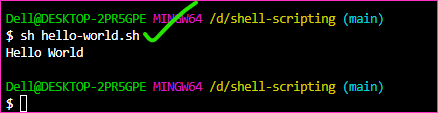
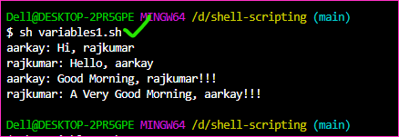
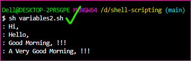
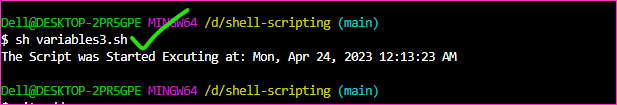
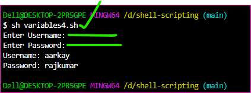
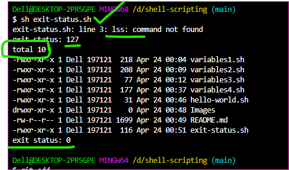
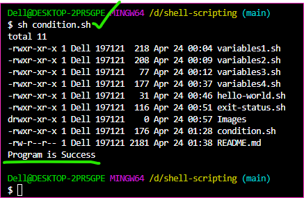

Shell-Scripting (SS)
--------------------

* Pre-requisite: Linux basic knowledge

OS used
--------

* I am mostly using AWS Linux 2. You can use any OS like Ubuntu, Centos, etc. Few commands will be changed based on OS.
    * For Ubuntu username is ubuntu.
    * For Centos username is centos.
    * For AWS Linux 2 username is ec2-user.

### The hello-world.sh

```bash
#!/bin/bash

echo "Hello World"
```


* Firstly we are using variables, let's get started

### The variables1.sh  

* [refer here](https://github.com/qtaarkayapril23/shell-scripting/commit/18d6b2a14412ceefa80ffc6711eabfa04e152467#diff-eb2438092149171548e316f9dda1827048d28e7ef3d5d41b8f49dd267d96fd01) for the first script variables1.sh

* The output getting



### The variables2.sh

* [refer here](https://github.com/qtaarkayapril23/shell-scripting/commit/18d6b2a14412ceefa80ffc6711eabfa04e152467#diff-9731339ca5c929ab416ca6bca927204cbc0e0dbf5e5b64f9f3ed3cfe72ea3380) for the script variables2.sh

* The output getting



### The variables3.sh

* [refer here](https://github.com/qtaarkayapril23/shell-scripting/commit/18d6b2a14412ceefa80ffc6711eabfa04e152467#diff-7c834c54f7cdb526cf218412de20e1cc43e51d848c5f1540ba6bbb53eef360ac) for the script variables3.sh

* The output getting



### The variables4.sh

* [refer here](https://github.com/qtaarkayapril23/shell-scripting/commit/d370311e1a857d5d53e97773a46d8858b667a7a2#diff-670efdd233050912b7bc78e17773b4d26333a81d794616cbc8afa2b50e09f62c) for the script variables4.sh

* The output getting



### The exit-status.sh

* [refer here](https://github.com/qtaarkayapril23/shell-scripting/commit/b6708d8d37f06b8d3b05b3151fca45e6d991242f#diff-4ba99d10b4d7a5f8b4ea1343e06b2cba203f6fb97a3b979f4bef1310ae2d91b9) for the script exit-status.sh

* The getting output



### The condition.sh

* [refer here](https://github.com/qtaarkayapril23/shell-scripting/blob/main/condition.sh) for the script condition.sh 

* The getting output



### The git-install.sh

* [refer here](https://github.com/qtaarkayapril23/shell-scripting/blob/main/git-install.sh/) for the script git-install.sh

* The getting output


